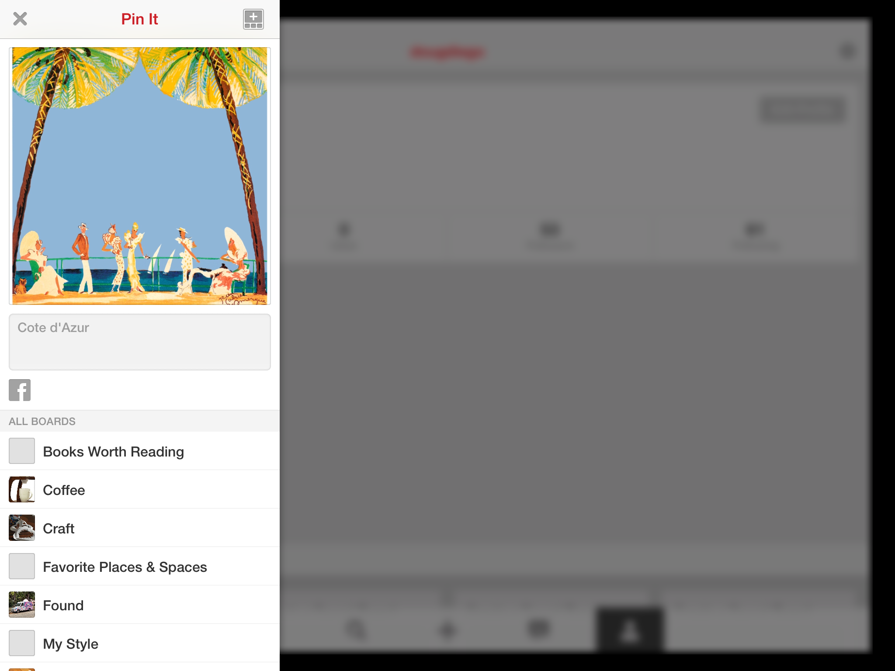

#Share

The ArtAPI extends the native UISharingActivityProvider.  It does the following:
* Add support for Pinterest
* Adds a custom HTML template for the email

Here is an example how to to share an item with the share framework:

```
-(void) showShare {
	NSArray * excludeActivities = @[UIActivityTypeMail, UIActivityTypeAssignToContact, UIActivityTypeCopyToPasteboard, UIActivityTypePostToWeibo, UIActivityTypePrint, UIActivityTypeSaveToCameraRoll];
    
    ACSharingActivityProvider *sharingActivityProvider = [[ACSharingActivityProvider alloc] init];
    sharingActivityProvider.title = @"Foggy landscape at sunrise";
    sharingActivityProvider.imageURL = @"http://imgc.artprintimages.com/images/photographic-print/frank-krahmer-foggy-landscape-at-sunrise_i-G-61-6164-R7UG100Z.jpg?w=894&h=671";
    sharingActivityProvider.sourceURL = @"http://www.art.com/products/p12819174139-sa-i8659786/frank-foggy-landscape-at-sunrise.htm?upi=ap8659786_pc4990875_fi0_sv6_it1_vrv1&PodConfigID=4990875";
    sharingActivityProvider.iTunesURL = @"https://itunes.apple.com/us/app/artdials/id762656439?mt=8";
    sharingActivityProvider.appName = NSLocalizedString(@"APP_NAME", @"artDials™ iPad app");
    
    ACPinterestActivity * pinterestActivity = [[ACPinterestActivity alloc] initWithClientId:@"1433645"
                                                                            urlSchemeSuffix:@"prod"];
    
    ACMailActivity * mailActivity = [[ACMailActivity alloc] init];
    
    // DEMO only, do not load an image like this.    
    UIImage *image = [UIImage imageWithData:[NSData dataWithContentsOfURL:[NSURL URLWithString: sharingActivityProvider.imageURL]]];

    ACActivityViewController* vc = [[ACActivityViewController alloc] initWithActivityItems:@[sharingActivityProvider,image, sharingActivityProvider.title, sharingActivityProvider.sourceURL]
                                                                     applicationActivities:@[mailActivity,pinterestActivity]];
    vc.excludedActivityTypes = excludeActivities;
    vc.itemId = @"12819174139A"; // APNum
    
    [self presentViewController:vc animated:YES completion:nil];
}
```
Note that you must pass in your own Pinterest ClientId and Url Scheme Suffix


